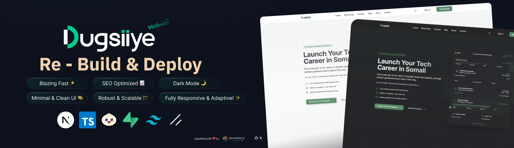

<div align="center">
  <br />
    
  <br />

  <div style="padding-top: 20px">
    
    
    
    
  </div>

  <h3 align="center">Dugsiiye: Tech & AI Learning Platform</h3>

  <div align="center">
    Start your journey to become a software developer with our comprehensive tutorials. Join the Dugsiiye community today!
  </div>
</div>

## 📋 Table of Contents

1. 🤖 [Introduction](#introduction)
2. ⚙️ [Tech Stack](#tech-stack)
3. 🔋 [Features](#features)
4. 🤸 [Quick Start](#quick-start)
5. 🕸️ [Code Snippets](#snippets)
6. 🔗 [Assets](#assets)
7. 🚀 [More](#more)

## 🤖 Introduction

Dugsiiye is a learning platform that provides detailed courses in AI, full-stack development, and more. The courses are designed for all levels, offering real-world, project-based learning in a variety of tech stacks.

## ⚙️ Tech Stack

- Next.js
- TypeScript
- PostgreSQL
- Upstash
- Tailwind CSS

## 🔋 Features

### Key Features of Dugsiiye

👉 **Open-Source Learning**: Access free courses and tutorials on web development, mobile app development, and more.  
👉 **Community Projects**: Collaborate on open-source projects and contribute to real-world applications.  
👉 **Interactive Tutorials**: Step-by-step guides to build projects like this platform.  
👉 **Modern UI/UX**: Built with Tailwind CSS and ShadCN for a seamless user experience.  
👉 **Scalable Architecture**: Designed for real-world scalability with Next.js and PostgreSQL.

## 🤸 Quick Start

Follow these steps to set up the **Dugsiiye Platform** locally on your machine.

**Prerequisites**

- [Git](https://git-scm.com/)
- [Node.js](https://nodejs.org/en)
- [npm](https://www.npmjs.com/)

**Cloning the Repository**

```bash
git clone https://github.com/moelkenzi/dugsiiye-clone.git
cd dugsiiye-clone
```
